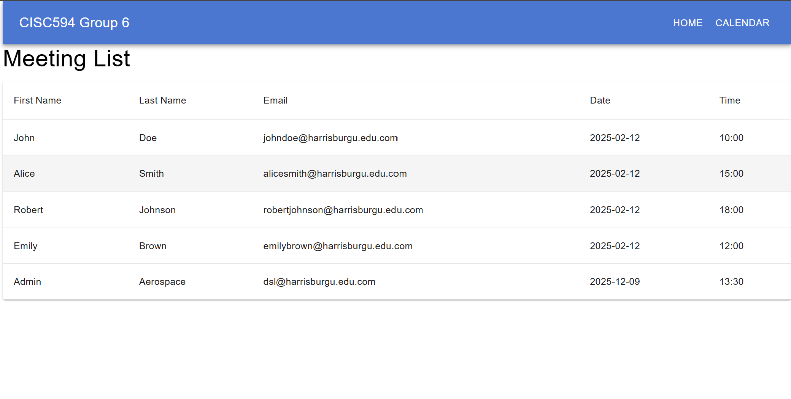
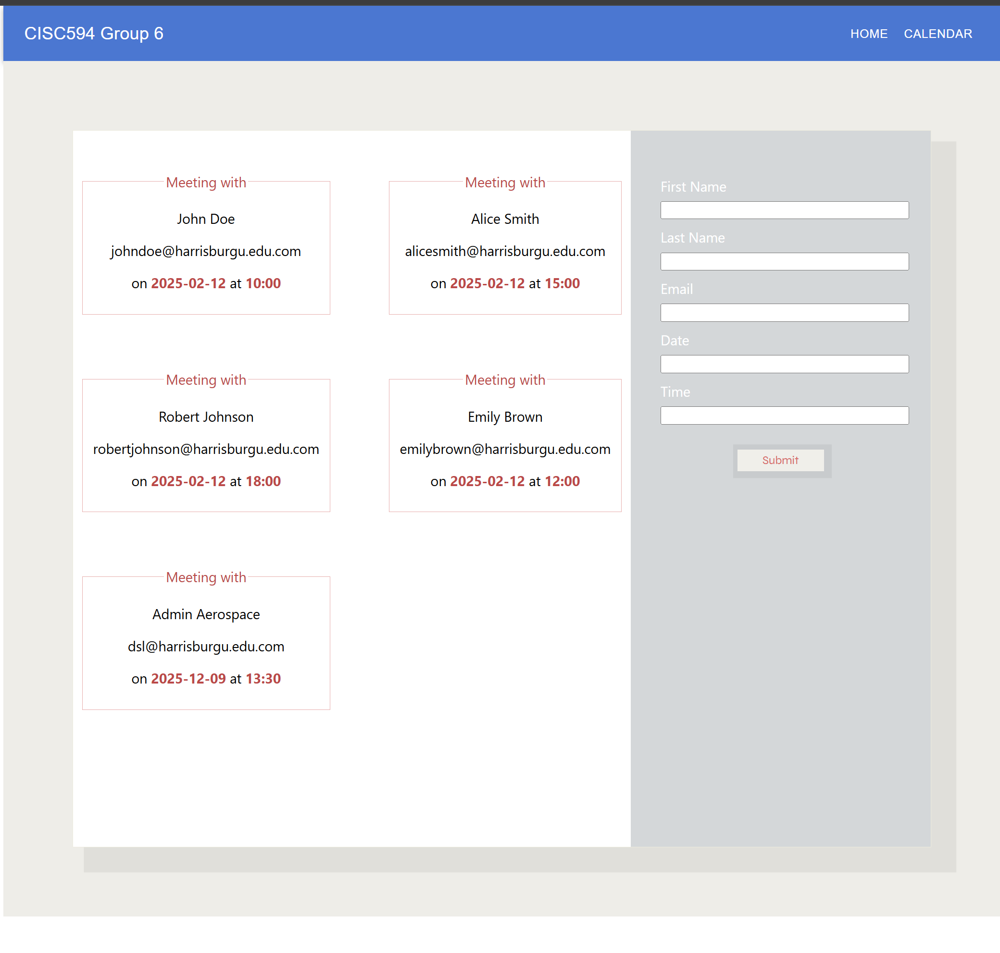

# DMC Project

## Overview

The DMC project is a web application designed to meeting managment.

## Features

- [Meeting managment]:
- [Study list]:

## Screenshots




## Installation

To set up the project locally, follow these steps:

1. **Clone the repository**:
   ```bash
   git clone https://github.com/YiliZh/dmc.git
   cd dmc

2. **Run npm install command to install all npm packages.**
   ```bash
   npm install

3. **Run the following command to satrt the project**
   ```bash
   npx json-server --watch src/db/data.json --port 3005

 

4. **Run the following command in your terminal:**
   ```bash
   set NODE_OPTIONS=--openssl-legacy-provider

   For PowerShell, use:
   $env:NODE_OPTIONS="--openssl-legacy-provider"

5. ***Then, restart your app with:***
   ```bash
   npm start

6.  **start the local service.**
   ```bash
   Localhost port: http://localhost:3005/meetings


